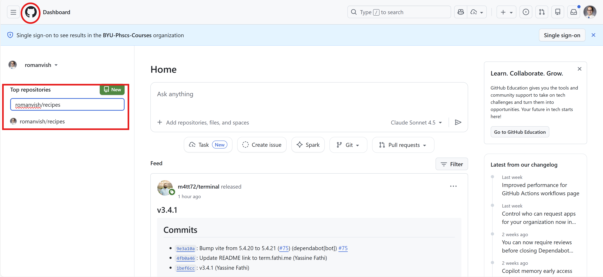
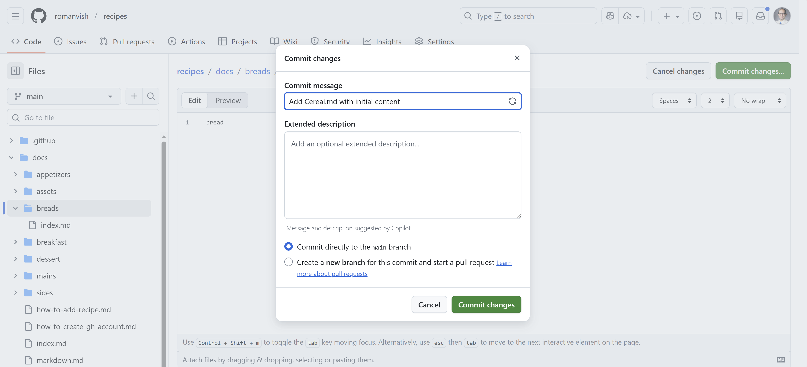

# How to: Add a recipe to the Site

Adding a recipe to this site involves a few steps, but don't worry—I'll guide you through the process. Here's how to do it:  

1. **Create a GitHub Account**  
    If you don't already have a GitHub account, you'll need to create one. Follow the instructions in the [How to: Create a GitHub Account](./how-to-create-gh-account.md) guide.
    
2. **Find the Repository on your GitHub Account**  
    Once you have a GitHub account, I'll add you as a collaborator to the repository that hosts this site. You'll receive an invitation via email or notification on GitHub, email is easier to figure out. Accept the invitation to gain access. Once you log in, it should take you to a dashboard page that will look pretty empty, but on the left side you should see a section called "Top Repositories". You should see a list of repositories you have access to, including one called `romanvish/recipes` click on that to open it. You can also search for it in the little search bar at the top if you don't see it right away, like is shown in the image. Also if you ever accidently go away from the main dashboard, you can click on the little circle icon in the top left and it will take you back to this page, circled in red in the image below.  <br><br>

    

3. **Navigate to the docs Folder**  
    Inside the repository, look for a folder named `docs`. Click on it to open the folder where all the files/sections are stored.

    

4. **Create a New File for Your Recipe**  
    Inside the `docs` folder, you can either click on a category that your recipe fits in, or just add a new file right where you're at. To do this, click on the "Add file" button and select "Create new file". Name your file using the format `your-recipe.md`, replacing `your-recipe` with the name of your recipe (e.g `chocolate-cake.md`). Note that there can't be spaces and the file must end in `.md`. 

    
    
5. **Add Your Recipe Content**
    This is where you'll actually paste in the content of the recipe. If you have a recipe you'd like to add from your own lists, or one from the internet, you can copy and paste the recipe Ingredients and Instructions into ChatGPT and ask it to format it in Markdown for you. Here's an example of the prompt I use to format something as Markdown in ChatGPT:

    ```
    Hi Chat, can you please format the recipe below using the Markdown format seen here? Please produce the Markdown code for me.
    # Title of Recipe
    ## By: <Insert Name>
    ### Attributed to: <Who's recipe is this based on?>

    ### Preparation Time: XX minutes
    ### Cooking Time: XX minutes

    ### Ingredients List:
    - Ingredient 1
    - Ingredient 2
    - Ingredient 3

    ### Instructions:
    1. Step one of the recipe
    2. Step two of the recipe
    3. Step three of the recipe

    ### Notes:
    - Any additional notes about the recipe
    - Variations or tips

    <Remove this and insert your recipe here>
    ```

    Once you have the Markdown code for your recipe (it'll have a bunch of hashtags and dashes), paste it into the new file you created in the GitHub repository in the large text area that says "Enter file contents here". You may have to modify some things, like the title, your name, or the recipe itself because sometimes ChatGPT is a little finnicky with this, but it should be pretty close to what you need. If anything looks weird, let me know and I can take care of it. You'll put the recipe text in the big box that says "Enter file contents here".  
6. **Save Your Changes**
    After you are done pasting in your changes, click the green "commit changes" button near the top left, and then click commit changes again on the pop-up with all the default values, and it will sync to the website automatically within about 2 minutes.

    